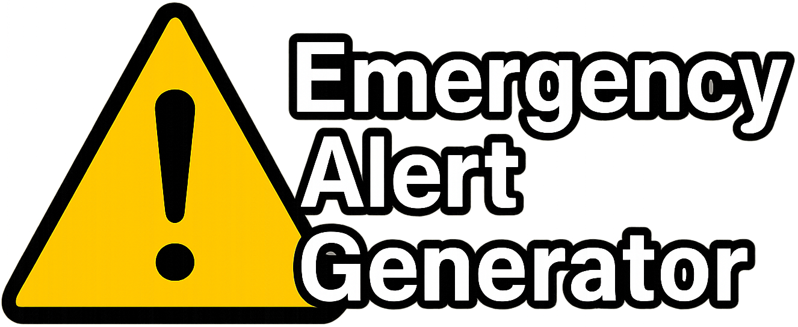

> [!CAUTION]
> The contents of this repository highlights a crucial government system designed to alert the public urgently in an emergency. Tampering, broadcasting, or spoofing restricted radio signals such as the ones used in the EAS is illegal. This repository and its code exists for educational purposes only. YOU ARE SOULY RESPONSIBLE FOR THE USE AND DISTRIBUTION OF ALERTS GENERATED FROM THIS TOOL!



---


This project exists to explore & demonstrate the United States Emergency Alert System, and how Specific Area Messages are encoded (SAME) for civil, national, and weather alerts. 

This accompanies a full write-up article on Medium which explores more details of the Emergency Alert System and NOAA Weather Radios. [Click here to read the article](https://medium.com/@oglesbeejacob/hacking-the-airwaves-simulating-emergency-alerts-with-a-pi-and-sdr-de578e40f53b).

## About This Project

This Github Project will generate radio-ready Waveform files that will trigger NOAA Weather Radios and other EAS SAME Decoders that do not verify any type of signature. 

Some other key notes are below:

* FIPS County and State codes are retrieved from the Census Web API when supplying the real name of a State and County.
* This generator uses the Google TTS Python library to add messages following the Attention Tone. This is intentionally not the normal Paul TTS used by EAS Alerts.

> [!NOTE]
> I cannot completely guarantee the authenticity of these generated alerts against real EAS Equipment. EAS Decoder software such as [SeaTTY](https://www.dxsoft.com/en/products/seatty/) and [samedec](https://crates.io/crates/samedec) decode output Waveforms properly, as well does a physical NOAA Weather Radio, which suggests these follow the specification "close enough" for most scenarios. However, this uncertainty means I cannot recommend using this project in actual real-world scenarios for any reason. However, if you're an EAS operator and want to validate a generated alert (safely), and let me know, please feel free to reach out!

## Watch the Video Example
Below is a video example demonstrating transmitting the EAS Alert and receiving it on a NOAA Weather Radio.

[](https://youtu.be/Q81Cd0IZ0RE)

## Installing & Using This Project
This project has been tested with Python Version 3.12.10. 
To install this project and it's dependencies:
1. `git clone https://github.com/JacobSecOps/Emergency_Alert_Generator.git`
2. `pip install -r requirements.txt --upgrade`

To use the EAS Generator, the following options are required:

|Short Option|Long Option|Description|Example|
|------------|-----------|-----------|-------|
|-s|--state|The full name of the state to target.|"Florida"|
|-c|--county|The full name of the county to target in the specified state.|"Orange"|
|-m|--message|The Text-To-Speech message to include as part of the alert."|"This is an example TTS Message."|
|-od|--day|The Julian Day this alert originates from.|"120"|
|-oh|--hour|The Julian Hour this alert originates from.|"22"|
|-om|--minute|The Julian Minute this alert originates from.|"15"|
|-or|--origin|The Originator which sent this alert.|"EAS","CIV","WXR","PEP"|
|-ev|--event|The Event Code this alert is for.|An Event Code from [this list](https://www.ecfr.gov/current/title-47/chapter-I/subchapter-A/part-11/subpart-B/section-11.31#p-11.31(e)).
|-du|--duration|How long this alert is valid for.|"0015"
|-id|--identification|The identity of who sent the alert. Max length is 8 characters.|"EXAMPLE"
|-at|--attention-tone|Duration of the Attention Tone in seconds.|"8"|
|-o|--output|Output WAV File Path.|"eas_output.wav"|

Example command:

```bash
python eas_generator.py --state "Ohio" --county "Franklin" --message "This is a test of the EAS Generator" --day "110" --hour "2" --minute "22" --origin "WXR" --event "RWT" --duration "0015" --identification "NWS/KILN" --attention-tone "8" --output "example_output.wav"
```

## Emergency Alert SAME Header Format
Emergency Alerts follow a specific format to be used by decoders and NOAA Weather Radios. This format is fully documented [here](https://www.ecfr.gov/current/title-47/chapter-I/subchapter-A/part-11#11.31). The most important information is noted below.

Example SAME Header: `[PREAMBLE]ZCZC-ORG-EEE-PSSCCC-+TTTT-JJJHHMM-LLLLLLLL`

* `[PREAMBLE]` is a stream of 16 Hexadecimal AB bytes, and essentially exists to clear an EAS decoder system in preparation for the alert itself.
* `ZCZC` is static text, acting as an identifier.
* `ORG` is the originating party who activated the EAS. These are listed [here](https://www.ecfr.gov/current/title-47/chapter-I/subchapter-A/part-11/subpart-B/section-11.31#p-11.31(e)).
* `EEE` is the event code and ultimately tells you why the EAS was activated. These are listed [here](https://www.ecfr.gov/current/title-47/chapter-I/subchapter-A/part-11/subpart-B/section-11.31#p-11.31(e)).
* `PSSCCC` is a 6 digit numeric string representing the area(s) of the country which is affected by an alert. SAME Headers can support up to 31 locations in one single alert.
    * `P` represents a subdivision of an unusually shaped county, or designed for more specific targeting (usually "Northwest", "Southeast" or other sectioning). In practice, P is not used very frequently.
    * `SS` represents the 2-digit state code being targeted. These are listed [here](https://www.ecfr.gov/current/title-47/chapter-I/subchapter-A/part-11/subpart-B/section-11.31#p-11.31(f)). A state code of 00 targets all states (the whole country).
    * `CCC` represents a 3-digit county/city code which can be found easily on the NWS website found [here](https://www.weather.gov/nwr/counties). When browsing one of these lists, the SAME location code is the combination of State and County (SSCCC), so for Ohio in Franklin County, it would be 39 for Ohio, and 049 for the county.
* `+TTTT` represents the valid time period of the message, starting in 15 minute increments and then 30 minute increments past one hour. Fun fact, this is why Weather Alerts always land on evenly distributed timespans.)
* `JJHHMM` represents the day in Julian Calendar Days, hours, and minutes when the message was originally sent in UTC.
* `LLLLLLLL` represents the originating office of the EAS message, or who is retransmitting it. This string is appended to messages automatically by the EAS encoder devices.

## Responsibility & Liability
The author assumes no responsibility for how EAS Alerts generated by this project are used. All EAS Protocol specification and frequencies are fully documented in the Code of Federal Regulations, accessible [here](https://www.ecfr.gov/current/title-47/section-11.31). No reverse engineering or physical hacking was performed in the making of this project.
